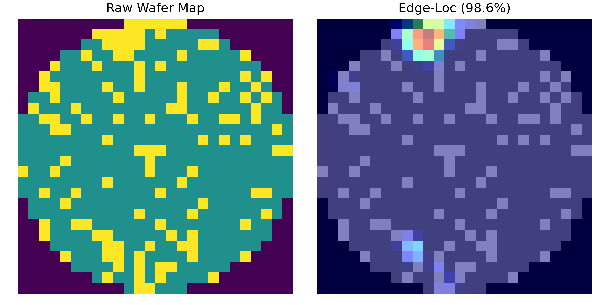

# Wafer Defect Classification via Classical ML and CNNs on an Augmented Dataset

## 1. Project Overview
This project revisits and implements two foundational approaches for wafer map defect classification using the [WM-811K dataset](https://www.kaggle.com/datasets/qingyi/wm811k-wafer-map) — a large-scale dataset of wafer maps collected from real semiconductor manufacturing lines:

- A classical machine learning pipeline using SVM and handcrafted features, based on the work of [Wu et al.](https://doi.org/10.1109/TSM.2014.2364237)
- A supervised CNN approach inspired by a [CVLab blog post](https://cvlab.tistory.com/54), with added data augmentation using autoencoders

While these methods are relatively basic compared to state-of-the-art deep learning techniques, this project demonstrates how they can still provide meaningful insights — especially when applied to unlabeled production data. It also explores **explainability via Grad-CAM**, applied to high- and low-confidence predictions made by the CNN model.

This repository includes a modular training pipeline, a comparison dashboard built with Streamlit, and utility scripts for visualizing Grad-CAM overlays across defect classes.

**Note:** The raw data and pre-trained models are too large for GitHub.  
You can recreate or download them as follows:
- **Original WM-811K pickle (`LSWMD.pkl`)**: available publicly on Kaggle (https://www.kaggle.com/datasets/qingyi/wm-811k-wafer-map)
- **Augmented dataset (`augmented_dataset.npz`)**: generate via `src/data_augmenter.py` (instructions in Section 4.2 of this README)  
- **Pre-trained CNN (`cnn_model.h5`)**: train with `src/train_cnn_model.py` 

---

## 2. Motivation

This project began as an exploration into how machine learning and deep learning techniques can be applied to defect pattern classification in semiconductor manufacturing. Given the complexity of real wafer map distributions and the limited amount of labeled data, the goal was to study and visualize how different models behave, compare traditional and deep learning approaches, and investigate model explainability using Grad-CAM overlays on unlabeled wafer maps.

---

## 3. Dataset Summary

This project uses the **WM-811K wafer map dataset**, which contains over 800,000 wafer images from real semiconductor manufacturing processes. Each wafer map is represented as a 2D grid where pixel values (0, 1, or 2) denote different die states (e.g., pass/fail/empty). Some maps are labeled with defect types, while others are unlabeled — reflecting real-world data imbalance in failure diagnosis.

### Key Properties
- **Total wafers**: 811,457  
- **Labeled wafers**: 172,950 (~21.3%)
- **Unlabeled wafers**: 638,507 (~78.7%)
- **Wafer map resolution**: Wafer sizes have a huge range, with maximum being (300, 202) and minimum being (6, 21). Number of unique wafer dimensions is 632.
- **Label imbalance**: Over 85% of labeled wafers belong to the "none" (no defect) class

### Defect Classes Explanation

| Class       | Description                              |
|-------------|------------------------------------------|
| Center      | Defects clustered near the center        |
| Donut       | Ring-shaped defect patterns              |
| Edge-Loc    | Defects localized near wafer edge        |
| Edge-Ring   | Circular band near the edge              |
| Loc         | Localized defect cluster                 |
| Near-full   | Defects spread across almost the entire wafer |
| Random      | Sparse and random defect locations       |
| Scratch     | Line-shaped scratches                    |
| none        | No clear pattern / normal wafer          |

### Labeled Wafer Distribution

|  | **Defect Type** | **Count** | **Percentage (%)** |
|---|----------------|----------:|-------------------:|
| 0 | Center         |     4,294 |               2.48 |
| 1 | Donut          |       555 |               0.32 |
| 2 | Edge-Loc       |     5,189 |               3.00 |
| 3 | Edge-Ring      |     9,680 |               5.60 |
| 4 | Loc            |     3,593 |               2.08 |
| 5 | Near-full      |       149 |               0.09 |
| 6 | Random         |       866 |               0.50 |
| 7 | Scratch        |     1,193 |               0.69 |
| 8 | none           |   147,431 |              85.24 |

### 26×26 Labeled Wafer Maps (Before Augmentation)

| **Defect Type** | **Count** |
|----------------|----------:|
| Center         |        90 |
| Donut          |         1 |
| Edge-Loc       |       296 |
| Edge-Ring      |        31 |
| Loc            |       297 |
| Near-full      |        16 |
| Random         |        74 |
| Scratch        |        72 |
| none           |    13,489 |

Due to the extremely low number of labeled 26×26 maps for minority classes (e.g., Donut, Near-full), model training using raw data alone would lead to severe class imbalance and poor generalization.

### Augmented Dataset (Used for CNN Training)

To mitigate the imbalance, an **autoencoder-based augmentation pipeline** was used to generate synthetic examples for underrepresented defect types. The resulting dataset is much more balanced across classes:

| **Defect Type** | **Augmented Count** |
|----------------|--------------------:|
| Center         | 2,160               |
| Donut          | 2,002               |
| Edge-Loc       | 2,368               |
| Edge-Ring      | 2,046               |
| Loc            | 2,376               |
| Near-full      | 2,088               |
| Random         | 2,032               |
| Scratch        | 2,146               |
| none           | 13,406              |

### Training Logic Summary

- The **Wu et al. SVM model** was trained on the full labeled wafer dataset, regardless of wafer size, using handcrafted features extracted from each map.
- The **CNN model**, by contrast, was trained **only on the 26×26 maps** — using the **augmented dataset** to address imbalance and enforce uniform input dimensions (required by CNN layers).

*Note: CNNs generally require fixed-size input tensors, which is why only 26×26 maps were used. Augmentation also helped prevent overfitting due to limited real samples per class.*

---

## 4. Methodology 

### 4.1 Wu et al. Feature-Based SVM Classification

This baseline classifier implements the classical approach proposed in [Wu et al. (2015)](https://doi.org/10.1109/TSM.2014.2364237), using handcrafted features to represent wafer maps and a Linear Support Vector Machine (SVM) to classify them.

The model was trained on the **entire original labeled dataset**, not restricted to 26×26 maps, allowing the feature extraction to leverage more spatial information from larger wafers.

#### Feature Extraction

Each wafer map is transformed into a **60-dimensional feature vector** combining three main descriptors:

- **Local Region Defect Density (13 features):**  
  The wafer is split into 13 spatial zones (edges and interior blocks), and each region’s defect density is calculated as the percentage of pixels labeled as `2` (indicating defects).

- **Radon Transform Statistics (40 features):**  
  The Radon transform captures the global line-like structures of defect patterns.  
  - 20-point interpolated **mean** values  
  - 20-point interpolated **standard deviations**

- **Geometric Properties (7 features):**  
  Shape descriptors are extracted from the largest defect region detected using connected component analysis:
  - Area  
  - Perimeter  
  - Centroid distance from center  
  - Major/minor axis lengths  
  - Eccentricity  
  - Solidity

These features are computed using `wu_features.py`, which modularizes each calculation for clarity and reuse.

#### Model Training and Evaluation

The feature vectors are used to train a **One-vs-One Linear SVM classifier** (`train_wu_model.py`), implemented using scikit-learn:

- Dataset is split into **train/test subsets** with stratification to preserve class distributions.
- Classifier is trained and evaluated with:
  - **Accuracy scores**
  - **Classification reports**
  - **Confusion matrices** (raw and normalized)

Both versions of the confusion matrix are saved as PNG files and used later for comparison in the dashboard.

| Step     | Description                              |
|----------|------------------------------------------|
| Model    | One-vs-One Linear SVM                    |
| Features | 60 handcrafted descriptors per wafer     |
| Training Data | All labeled wafer maps (not limited to 26×26) |
| Evaluation | Accuracy, classification report, confusion matrix |

The trained model is saved as `wu_svm_model.pkl` and later reused in the dashboard and unlabeled wafer analysis.

---

### 4.2 Data Augmentation Pipeline

To mitigate class imbalance and increase the effective sample size of labeled wafer maps, a convolutional autoencoder was trained to generate synthetic wafer maps for underrepresented defect types.

**Overview of the pipeline:**
- Filters the labeled dataset to include only **26×26** wafer maps.
- One-hot encodes each wafer pixel into **three channels** representing values 0 (background), 1 (non-defect), and 2 (defect).
- Trains a **shallow convolutional autoencoder** to reconstruct input maps.
- Perturbs the **latent space** to generate realistic but slightly varied synthetic wafers.
- **Upsamples** minority defect classes and slightly **downsamples** the dominant `none` class.
- Saves the augmented dataset to `data/augmented_dataset.npz` for use in supervised models.

#### Key Design Steps

- **Why 26×26 maps?**  
  Many wafers in the LSWMD dataset vary in size. To ensure compatibility across CNN-based models, only samples with fixed 26×26 dimensions were selected.

- **Why 3 channels?**  
  Each pixel in the wafer map is either background (0), normal (1), or defect (2). These were one-hot encoded into a (26×26×3) format, which helped the autoencoder model better distinguish pixel types during training.

- **Autoencoder Architecture:**  
  A compact convolutional autoencoder was used:  
  - Encoder: Conv2D + ReLU → MaxPooling  
  - Decoder: Conv2DTranspose + ReLU → Upsampling → Sigmoid  
  Trained using **Mean Squared Error (MSE)** loss and **Adam** optimizer for 15 epochs.

- **Latent space perturbation:**  
  After encoding the input wafers, **Gaussian noise** was added to the latent vectors. These noisy encodings were passed through the decoder to generate new, realistic variations.

- **Balancing strategy:**  
  - Classes like `'Donut'`, `'Near-full'`, and `'Scratch'` were significantly underrepresented. These were **upsampled** to approximately ~2,000 samples each.
  - The `'none'` class (non-defective wafers), which dominates the labeled dataset, was **randomly downsampled** to maintain balance.

#### Output Summary

- Final dataset dimensions:  
  **Images:** `X.shape = (21044, 26, 26, 3)`  
  **Labels:** `Y.shape = (21044, 9)` (one-hot encoded)

- Saved as:  
  `./data/augmented_dataset.npz`

---

### 4.3 CNN Supervised Pipeline

A supervised Convolutional Neural Network (CNN) was trained to classify wafer defect types using the **augmented 26×26 dataset** generated in the previous step. This section outlines the key design decisions and model implementation.

#### Why Augmented Data Only?

Unlike the Wu-SVM approach, which was trained on all original labeled data, the CNN model was trained **exclusively on the augmented 26×26 wafer maps**. This was done to:
- Ensure input consistency with the CNN architecture.
- Provide a more balanced and enriched dataset for training.
- Leverage synthetic samples to improve generalization.

#### Model Architecture

The CNN was built using **Keras** and consisted of the following layers:
- `Conv2D (64 filters, 3x3)` with ReLU activation  
- `MaxPooling2D (2x2)`  
- `Conv2D (128 filters, 3x3)` with ReLU  
- `MaxPooling2D (2x2)`  
- `Flatten`  
- `Dense (128 units)` with ReLU  
- `Dense (9 units)` with Softmax for 9 defect classes

This simple but effective architecture was chosen to keep training time short while capturing enough spatial structure to learn defect patterns.

#### Training Setup

- **Loss Function:** Categorical Crossentropy  
- **Optimizer:** Adam  
- **Batch Size:** 64  
- **Epochs:** 30  
- **Input Shape:** `(26, 26, 3)` (one-hot encoded wafer map)  
- **Output:** 9-way softmax (including 'none')

The model was trained on the full augmented dataset without a train/validation split (since it was mostly used for inference on unlabeled data).

#### Output

- Trained model saved to:  
  `./models/cnn_model.h5`

This CNN is later used to predict labels for previously unlabeled 26×26 wafer maps, enabling downstream explainability and inspection using Grad-CAM.

---

### 4.4 Wu-SVM on Augmented Dataset

To evaluate the effectiveness of data augmentation on traditional machine learning models, the Wu et al.-style SVM classifier was retrained using the same augmented dataset originally created for CNN training.

#### Why Re-Apply SVM to Augmented Data?

While the original Wu-style SVM was trained on all available labeled data (regardless of wafer map size), this version was retrained **only on the augmented 26×26 dataset**. This allowed:
- Direct comparability with the CNN, which was also trained on 26×26 augmented samples
- An opportunity to assess whether classical ML models also benefit from synthetic data balancing
- A fairer baseline for measuring accuracy across architectures

#### Data Preparation

- The augmented dataset (`augmented_dataset.npz`) was loaded from disk.
- Pixel-wise one-hot encoded wafer maps (`X`) and one-hot class labels (`Y`) were reshaped:
  - Input: `X.shape = (n_samples, 26, 26, 3)`
  - Labels: `Y.argmax(axis=1)` converted from one-hot to class indices
- Handcrafted features were re-extracted from each wafer map using the same method described in [Section 4.1](#41-wu-style-handcrafted-feature-extraction).

#### Model Training & Evaluation

- The extracted features were used to train a **One-vs-One Linear SVM** via `scikit-learn`.
- Model was evaluated on a train/test split (same logic as original Wu-SVM).
- Key outputs included:
  - Classification report
  - Accuracy metrics
  - Confusion matrix visualizations

#### Output

- Trained model saved as:  
  `./models/wu_svm_model_expanded.pkl`
- Confusion matrices saved to:
  - `./images/wu_conf_matrix(augmented_data).png`  
  - `./images/wu_conf_matrix_norm(augmented_data).png`

> This approach helps determine whether handcrafted feature pipelines remain competitive when given the same class balance advantages typically reserved for neural networks.

---

## 5. Model Performance

This section compares the classification performance of three different models trained during this project:

| Model | Training Data | Feature Type | Notes |
|-------|---------------|--------------|-------|
| **Wu-SVM (Original)** | Full Labeled Set (All Sizes) | Handcrafted | Trained on imbalanced data |
| **Wu-SVM (Augmented)** | Augmented 26×26 Dataset | Handcrafted | Benefits from class balancing |
| **CNN (Augmented)** | Augmented 26×26 Dataset | Learned (Deep Features) | Highest overall performance |

---

### 5.1 Quantitative Results

| Model                       | Accuracy | Precision (macro) | Recall (macro) | F₁ Score (macro) |
| --------------------------- | :------: | :---------------: | :------------: | :--------------: |
| **CNN**                     |  98.35 % |      99.10 %      |     97.55 %    |      98.29 %     |
| **Wu SVM (Augmented Data)** |  83.25 % |      82.49 %      |     82.90 %    |      82.65 %     |
| **Wu SVM (Original Data)**  |  80.20 % |      81.99 %      |     74.31 %    |      74.15 %     |

---

### 5.2 Confusion Matrix Visualizations

Each model’s performance is visualized via confusion matrices. Both raw and normalized forms are included to aid interpretability.

#### Wu-SVM (Original Data)
.png)  
.png)

#### Wu-SVM (Augmented Data)
.png)  
.png)

#### CNN (Augmented Data)
  


---

### 5.3 Observations

- **CNN model outperformed both SVMs**, especially on underrepresented classes like `Scratch` and `Donut`.
- **Data augmentation helped significantly**, even for the traditional Wu-SVM pipeline. Accuracy jumped from ~80% to ~83%.
- **SVM’s performance remained competitive**, and was notably efficient in training time and interpretability.
- **Imbalance in original data** led to bias toward the majority class `none`, visible in the original SVM confusion matrix.

---

### 5.4 Takeaway

Combining handcrafted features with traditional ML methods is still a valid approach—especially when dataset augmentation and filtering are carefully done. However, CNNs showed stronger generalization and class separation, particularly on edge cases.

---

## 6. Applying CNN to Unlabeled Wafer Maps (w/ Grad-CAM Explainability)

After training the CNN classifier on the augmented 26×26 dataset, the model was deployed to infer labels for unlabeled wafer maps in the original dataset.

Only wafer maps of shape **(26, 26)** were selected from the unlabeled portion, resulting in a total of **15,712** wafer maps. Using a softmax confidence threshold of **95%**, the model confidently classified **12,348** wafer maps — approximately **78.59%** of the unlabeled subset.

These predictions allow partial labeling of previously unlabeled data, which is useful for:
- Semi-supervised learning pipelines.
- Pattern mining in yield excursions.
- Monitoring for known failure modes in fab environments.

> **Note:** Only predictions exceeding a softmax confidence of 0.95 were retained.

All predictions were generated using the script: `./src/generate_gradcam_comparisons.py`

---

### 6.1 Grad-CAM: Visualizing CNN Attention

To better understand the CNN’s decision-making process, **Grad-CAM (Gradient-weighted Class Activation Mapping)** was applied to visualize which regions of each wafer map influenced the final prediction.

For each confidently predicted defect class, one **high-confidence** and one **low-confidence** sample was selected. Below are the Grad-CAM visualizations:

#### Center

| High Confidence | Low Confidence |
|-----------------|----------------|
|  |  |

#### Donut

| High Confidence | Low Confidence |
|-----------------|----------------|
|  |  |

#### Edge-Loc

| High Confidence | Low Confidence |
|-----------------|----------------|
|  |  |

#### Edge-Ring

| High Confidence | Low Confidence |
|-----------------|----------------|
|  |  |

#### Loc

| High Confidence | Low Confidence |
|-----------------|----------------|
|  |  |

#### Near-full

| High Confidence | Low Confidence |
|-----------------|----------------|
|  |  |

#### Random

| High Confidence | Low Confidence |
|-----------------|----------------|
|  |  |

#### Scratch

| High Confidence | Low Confidence |
|-----------------|----------------|
|  |  |

---

These visualizations provide key insights:
- **High-confidence predictions** correlate with clean, well-localized activation near defect regions.
- **Low-confidence predictions** show diffused or scattered attention, indicating ambiguity in the pattern.
- The CNN learns to attend to intuitive defect areas — e.g., outer rings in *Edge-Ring* maps, or central voids in *Donut* patterns — confirming some level of explainability.

> Grad-CAM played a crucial role in assessing the reliability of the CNN predictions, especially for application to unlabeled data.

---

## 7. Future Work

This project lays the foundation for further exploration in wafer map classification. Potential next steps include:

- **Integration of more advanced models** such as Vision Transformers or multi-scale CNNs tailored for sparse patterns.
- **Exploration of semi-supervised learning**, leveraging confident pseudo-labels from unlabeled data to refine model accuracy.
- **Real-time defect monitoring dashboard**, connecting predictions with process metadata for deeper yield insights.
- **Benchmarking against additional datasets** or creating synthetic ones to simulate rare failure types.

---

## 8. Project Structure

```
wafer-defect-classification/
├── app.py
├── data
│   └── high_confidence_unlabeled_preds_95.pkl
├── images
│   ├── cnn_conf_matrix_norm.png
│   ├── cnn_conf_matrix.png
│   ├── gradcam_Center_high.png
│   ├── gradcam_Center_low.png
│   ├── gradcam_Edge-Loc_high.png
│   ├── gradcam_Edge-Loc_low.png
│   ├── gradcam_Edge-Ring_high.png
│   ├── gradcam_Edge-Ring_low.png
│   ├── gradcam_Loc_high.png
│   ├── gradcam_Loc_low.png
│   ├── gradcam_Near-full_high.png
│   ├── gradcam_Near-full_low.png
│   ├── gradcam_none_high.png
│   ├── gradcam_none_low.png
│   ├── gradcam_Random_high.png
│   ├── gradcam_Random_low.png
│   ├── gradcam_Scratch_high.png
│   ├── gradcam_Scratch_low.png
│   ├── wu_conf_matrix_norm(augmented_data).png
│   ├── wu_conf_matrix_norm(original_data).png
│   ├── wu_conf_matrix(augmented_data).png
│   └── wu_conf_matrix(original_data).png
├── models
│   ├── wu_svm_model_expanded.pkl
│   └── wu_svm_model.pkl
├── README.md
├── requirements.txt
├── src
│   ├── conf_matrices.py
│   ├── data_augmenter.py
│   ├── generate_gradcam_comparisons.py
│   ├── train_cnn_model.py
│   ├── train_wu_model_expanded.py
│   ├── train_wu_model.py
│   └── wu_features.py
└── utils
    └── wu_viz.py
```


---

## 9. Credits & References

1. Wu, M.-J., Jang, J.-S. R., & Chen, J.-L. (2015). *Wafer Map Failure Pattern Recognition and Similarity Ranking for Large-Scale Data Sets*. IEEE Transactions on Semiconductor Manufacturing, 28(1), 1–12. [https://doi.org/10.1109/TSM.2014.2364237](https://doi.org/10.1109/TSM.2014.2364237)

2. CVLab. (2021, April 22). *CNN을 활용한 Wafer map 분류기 (Classification using CNN on Wafer Map)*. CVLab Blog. [https://cvlab.tistory.com/54](https://cvlab.tistory.com/54)

3. Kaggle. (2020). *Wafer Map Failure Classification*. [https://www.kaggle.com/datasets/qingyi/wm-811k-wafer-map](https://www.kaggle.com/datasets/qingyi/wm-811k-wafer-map)

4. Portions of project documentation and code organization were assisted using [ChatGPT](https://openai.com/chatgpt), an AI model by OpenAI.
